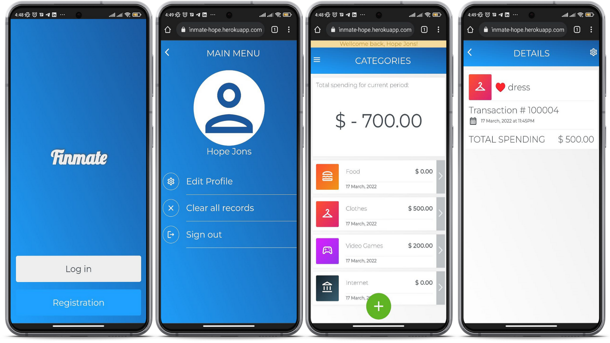

# ROR: Finmate

> ROR app to track the expenses.

ROR state app, allowing the clients to sign up and log in build on MVC architecture with CRUD principals. The app allows the client to track their expenses while dividing them into categories.

## Live demo
[www.fitmate.com](https://finmate-hope.herokuapp.com/)

## Built With

- Major languages: Ruby
- Frameworks: ROR
- Gems: devise, cancancan, RSpec

## Getting Started

To get a local copy up and running follow these simple example steps.

### Prerequisites

You need to have followings installed in your local machine:
- `Ruby`
- `Postgresql`
- `Rails`
- `RSpec`
- `node.js`

### Setup

To setup the Finmate project in your local, in the repo page: 
- click on code (dropdown list) > Download as ZIP. 
- or open terminal of path you want to install project and run this command:
`git clone git@github.com:Hope1226/expense-tracker.git`
- `cd expense-tracker/`
- `bundle install`
- `bin/rails db:create`
- `bin/rails db:migrate`

## Instruction on the usage
- Run the following comands in your command line:
- `rails s`
- `open any chrome/firefox`
- `type "localhost:3000"`
- `enjoy the app`

## Tests
- To run tests for current app, please run below commands in your terminal:
- `cd expense-tracker/`
- `rspec spec spec/test_file_name`

## Author

👤 **Umidjon Ustabaev**

- GitHub: [@Hope1226](https://github.com/Hope1226)
- LinkedIn: [LinkedIn](https://www.linkedin.com/in/umidjon-ustabaev/)

## 🤝 Contributing

Contributions, issues, and feature requests are welcome!

Feel free to check the [issues page](https://github.com/Hope1226/expense-tracker/issues).

## Show your support

Give a ⭐️ if you like this project!

## Acknowledgments

- This is app built withing the frames of CAPSTONE project of Rails Module at **[Microverse](https://www.microverse.org/)**, a remote web-developer school, using their support and frameworks provided. 
Original design idea by [Gregoire Vella](https://www.behance.net/gregoirevella)

## 📝 License

This project is [MIT](./MIT.md) licensed.
